# LAB3 - セキュリティ強化

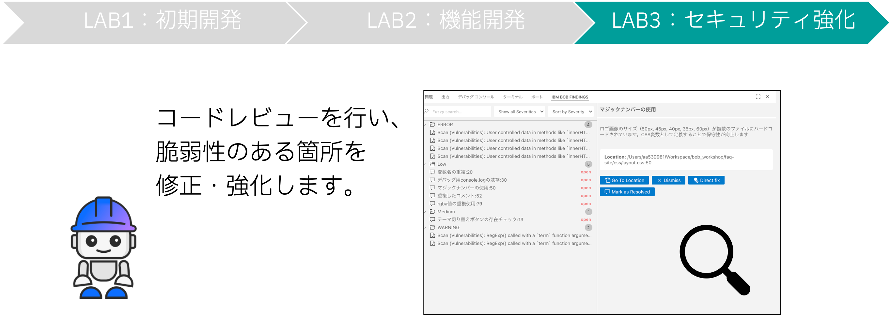
安全なアプリケーション運用のために、生成されたコードにセキュリティ上の問題がないか確認します。

- Bobを使ってコードレビューを実施する
- レビュー結果の中から1箇所を選び、修正を行う

## Reviewコマンドの実行

### 1. レビューの実行

チャット画面に「/review」と入力します。

**手順:**
1. チャット画面に `/review` と入力
2. 入力途中で候補が出てくるので、候補をクリック
3. 「実行」をクリック

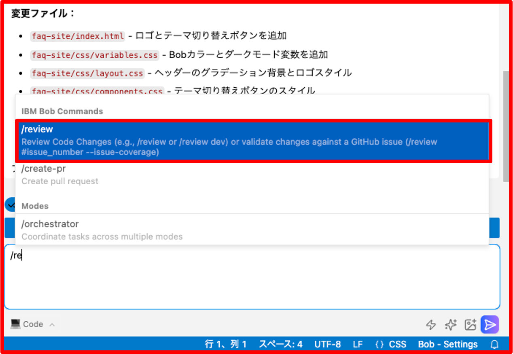

### 2. モード切り替えの承認

コマンドを送信すると、Bobがモードの切り替えの承認依頼を表示します。

表示された依頼に対して「承認」をクリックしてください。

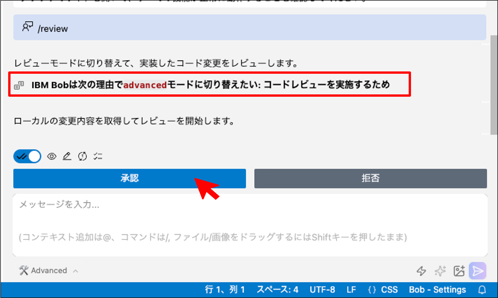

### 3. レビューの実行

モード切り替え後、Bobによってレビューが実行されます。

下の画像のようにBobがプロジェクトディレクトリの読み取りを行います。
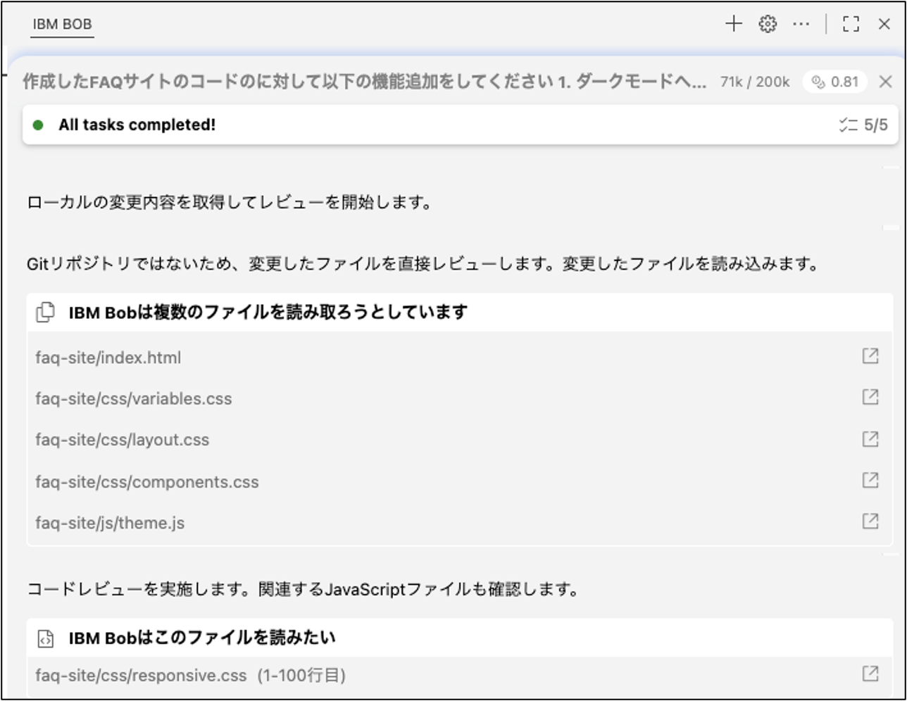

### 4. レビューの完了

レビューが完了すると、Bobがレビュー結果のサマリーを報告してくれるので、内容を確認します。

**サマリーの内容:**
- 検出された問題の総数
- 優先度別の分類
- 重要な問題のハイライト
- 改善すべきポイントを優先度別にレポート

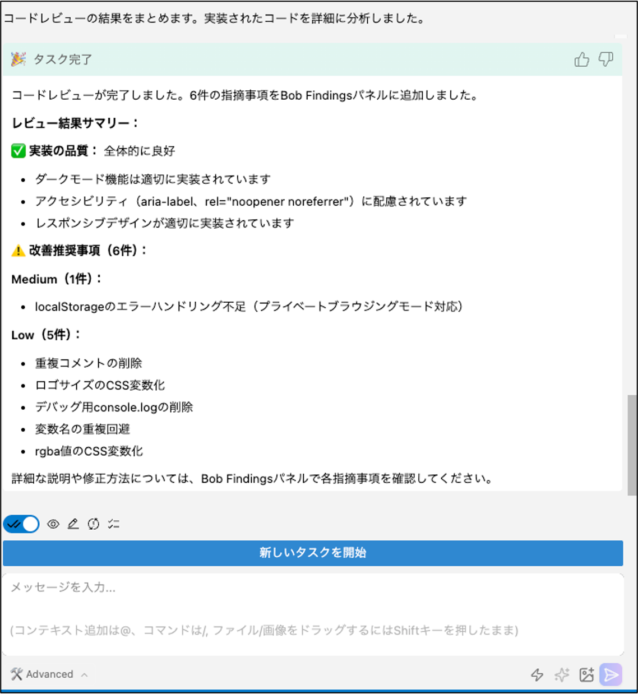

## BOB FINDINGSの確認

### 1. BOB FINDINGSの表示

レビューが完了すると、画面下にBOB FINDINGSが表示されます。

**注意:** 表示されない場合は、画面下部のボタンをクリックしてください。

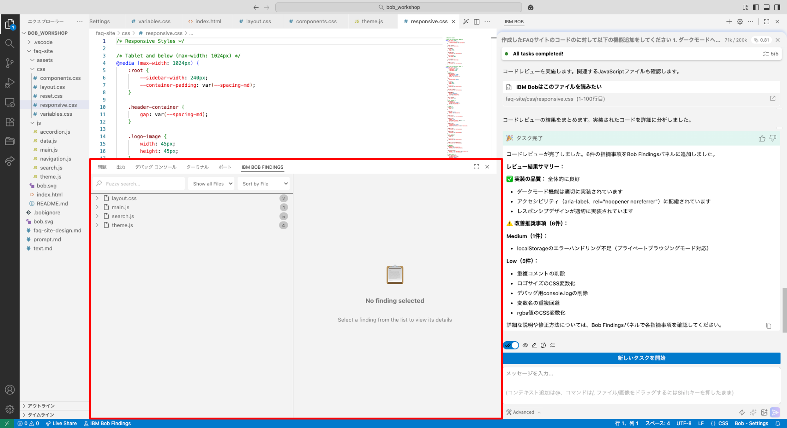

### 2. BOB FINDINGSの見方

BOB FINDINGSでは、ファイルごとにレビュー項目の数が表示されます。

**表示形式:**
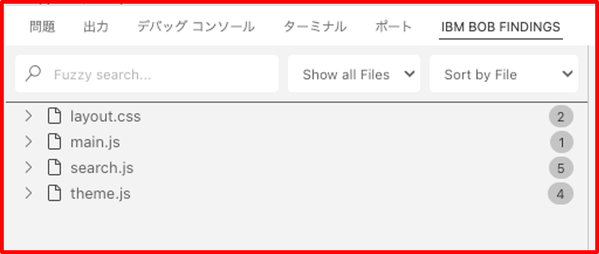

### 3. レビュー結果の一覧

ファイルを指定して展開すると、レビュー項目の一覧が表示されます。

**手順:**
1. ファイルを指定
2. レビュー箇所の一覧の確認

**表示される情報:**
- 問題の種類（セキュリティ、パフォーマンス、保守性など）
- 重要度（高、中、低）
- 該当する行番号
- 問題の説明

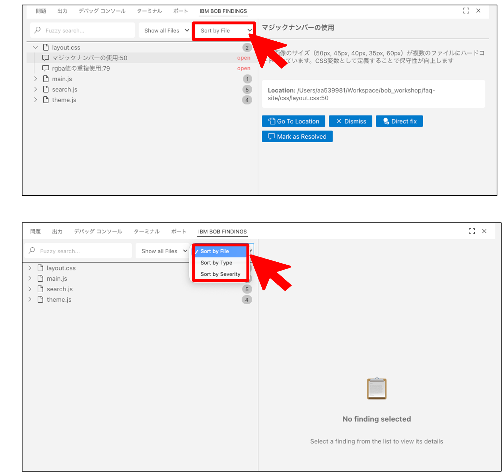

### 4. レビュー箇所の詳細

レビュー箇所をクリックすると、詳細結果が展開されます。

**詳細情報:**
- 問題の具体的な説明
- なぜ問題なのか
- 推奨される修正方法
- コード例
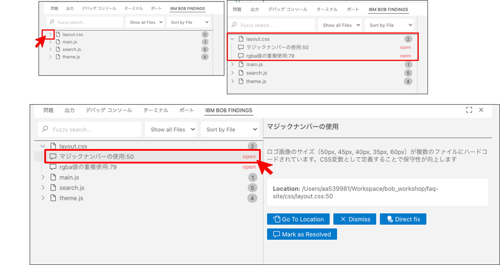

### 5. 並び替え方法の選択

ファイル別の表示だけでなく、カテゴリーや優先度順に並び替えることも可能です。

**並び替えオプション:**
1. ファイル別
2. カテゴリー別（セキュリティ、パフォーマンス、保守性）
3. 優先度別（高、中、低）

**手順:**
1. 並び替えボタンをクリック
2. 並び替え方法の選択
3. 優先度別の並び替え結果を確認

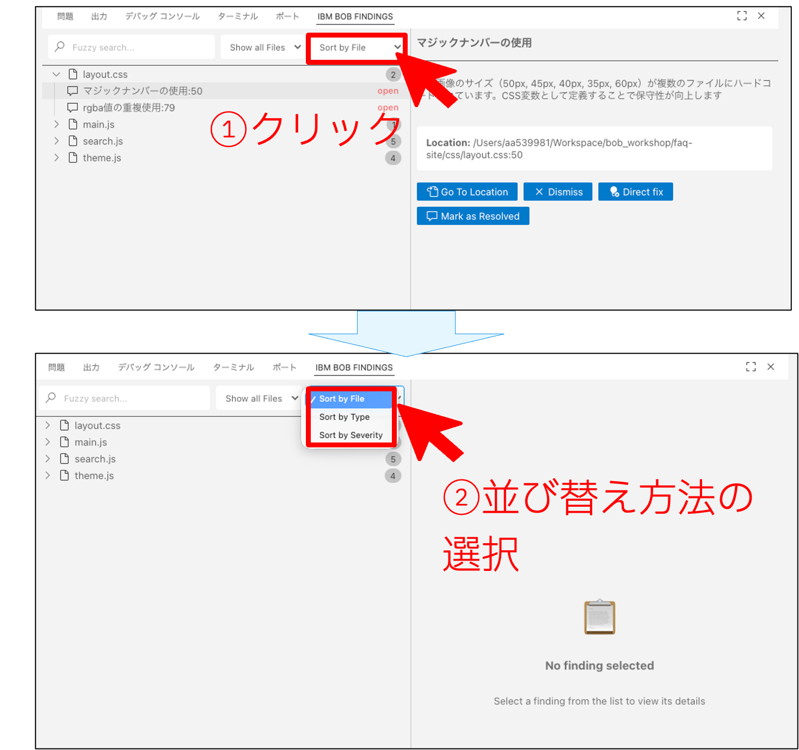

### 6. レビュー内容の確認

説明欄には、レビュー箇所の概要・推奨修正案が記載されています。

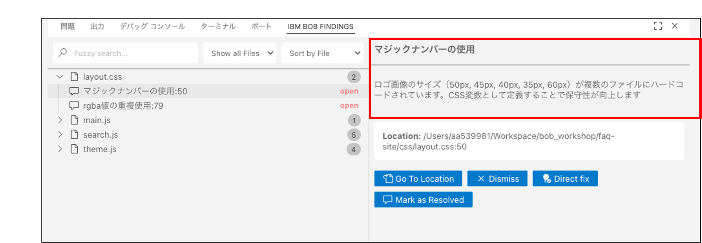

## エラー箇所の修正

### 1. 修正作業の開始

修正したい箇所を一つ選び、その中の「Direct fix」ボタンをクリックして修正を開始します。

**ユーザーのアクション:**
1. 修正したい項目を選択
2. 「Direct fix」ボタンをクリック

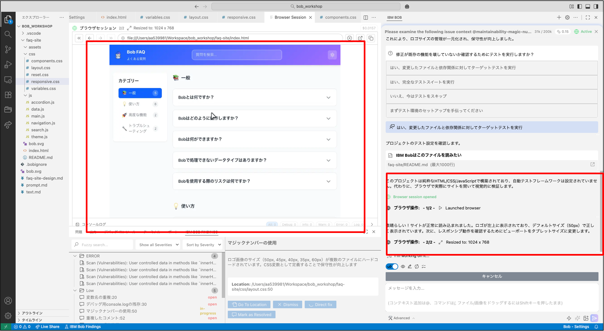

### 2. 修正内容の連携

修正作業が開始されると、BOB FINDINGS内のレビュー内容がBobに連携され、チャット画面にメッセージが生成されます。

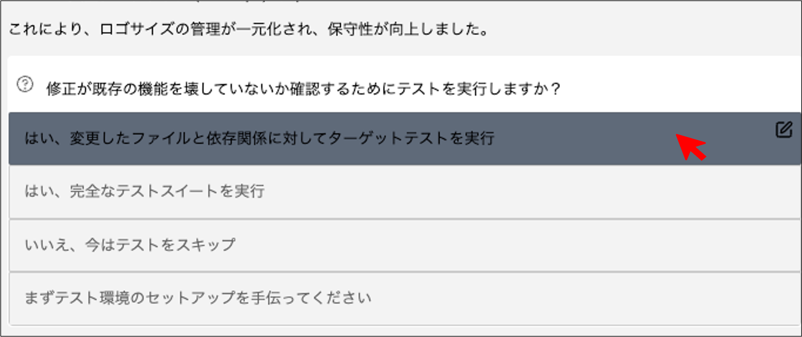

### 3. レビューサマリーの表示

修正が完了するとサマリーが表示されます。

**サマリーの内容:**
- 修正された問題
- 変更されたファイル
- 変更内容の概要
- 次のステップの提案

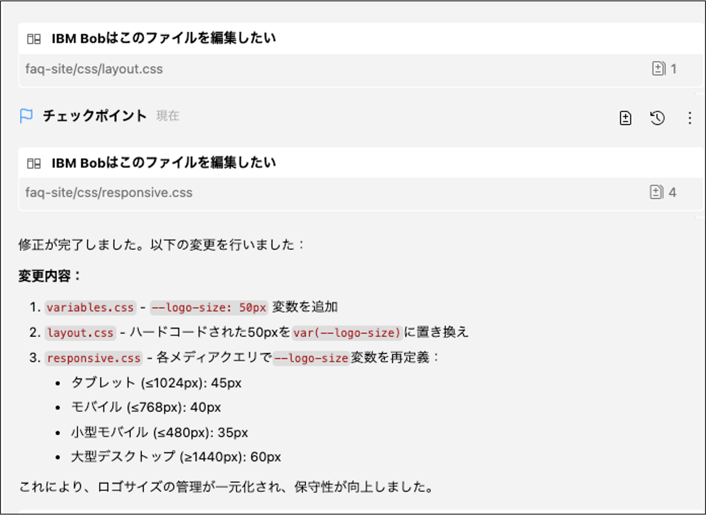

## 修正後のテスト実行

### 1. テストの実行

修正完了後にBobはテストの実行を提案してくれるため、「テストの実行」をクリックします。

**テストの目的:**
- 修正が正しく適用されたか確認
- 既存機能が壊れていないか確認
- 新たな問題が発生していないか確認

### 2. テストの実行プロセス

テストでは、Bobがブラウザ操作を行い、修正したコードが正しく動作しているかをチェックします。

**テスト項目:**
- ページの読み込み
- 各機能の動作確認
- エラーの有無
- パフォーマンスの確認

**ユーザーのアクション:**
- テスト結果を確認
- 問題があれば追加の修正を依頼

## Lab3完了

### LAB3の完了

ToDoリストがすべて完了してサマリーが出力されたら、LAB3は完了です！

**完了条件:**
- [ ] `/review` コマンドでコードレビューを実行
- [ ] BOB FINDINGSを確認
- [ ] 1つ以上の問題を修正
- [ ] テストを実行

お疲れ様でした！

---

**前へ**: [LAB2 - 機能開発](04_lab2.md) | **次へ**: [まとめ](06_summary.md)