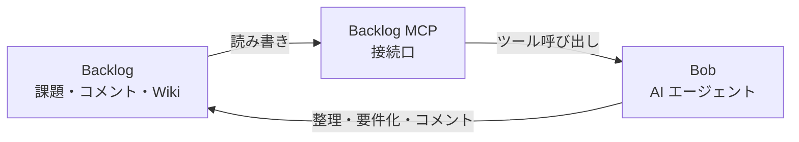

# Bob × Backlog MCP ハンズオン

Backlogに登録された課題を、Bob から Backlog MCP 経由で取得し、内容の整理・対応方針の作成・コメント追加までを体験するハンズオンです。

---

## 全体像

登場するのは 3 つだけです。



| 役割 | 説明 |
|------|------|
| **Backlog** | 課題、コメント、Wiki を管理する場所 |
| **Backlog MCP** | Bob が Backlog を読み書きするための接続口 |
| **Bob** | 課題の読み取り・整理・対応方針作成・コメント生成を行う AI エージェント |

---

## ⏱️ 所要時間

| セクション | 時間 |
|-----------|------|
| 概要説明 | 5 分 |
| セットアップ確認 | 10 分 |
| Lab 1：Backlog 課題を Bob で取得 | 5 分 |
| Lab 2：課題内容を整理 | 10 分 |
| Lab 3：対応方針と確認観点を作成 | 10 分 |
| Lab 4：Backlog へコメント追加 | 5 分 |

**合計**: 標準 45 分 / 短縮 25〜30 分

---

## 事前準備

### 1. Backlog アカウントを用意する

Backlog のアカウントがある場合はそのままお使いください。アカウントがない場合は、[Backlog 公式サイト](https://backlog.com/ja/) からスペースを作成してください。

!!! tip "お試しで使いたい場合"
    個人利用レベルであれば、無料で使える [フリープラン](https://backlog.com/ja/pricing/) も提供されています。

!!! warning "本番スペースは使わない"
    既存のスペースを使う場合でも、必ず**検証用プロジェクト**を新しく作成してください。

スペースを用意したら、スペースの URL（例：`your-domain.backlog.com`）を控えておきます。

### 2. Backlog プロジェクトを作成する

Backlog にログイン後、以下の手順でハンズオン用プロジェクトを作成します。

1. 画面上部の「新規プロジェクト」をクリック
2. 以下の内容で作成する

    | 項目 | 値 |
    |------|----|
    | プロジェクト名 | `Bob Backlog Workshop` |
    | プロジェクトキー | `BOBWS` |

3. 「作成」をクリック

### 3. ハンズオン用課題を作成する

作成したプロジェクトに課題を追加します。

1. プロジェクトページの「課題を追加」をクリック
2. 以下の内容を入力して保存する

    **件名**

    ```text
    FAQ画面で目的の質問を探しにくい
    ```

    **詳細**

    ```text
    お客様から、FAQ画面で目的の質問を探しにくいという問い合わせがありました。

    現状：
    - FAQが一覧で表示されている
    - 件数が増えてきたため、目的の質問を探すのに時間がかかる
    - 特に「料金」「契約」「ログイン」などのキーワードで探したいという要望がある

    期待すること：
    - 利用者が目的のFAQを見つけやすくしたい
    - どのような改善案が考えられるか整理したい
    - 開発チームが対応しやすいように、要件と確認観点を整理したい
    ```

3. 保存後、課題キー（例：`BOBWS-1`）が割り当てられることを確認する

### 4. Wiki を作成する（任意）

Bob が追加情報を参照できるように、Backlog Wiki に仕様メモを作成します。

1. プロジェクトページの「Wiki」タブをクリック
2. 「ページを追加」をクリック
3. 以下の内容を入力して保存する

    **Wiki 名**: `FAQ画面の仕様メモ`

    ```text
    FAQ画面は、利用者からよくある質問を一覧表示する画面です。

    現在の仕様：
    - FAQは一覧形式で表示する
    - FAQには質問文と回答文がある
    - カテゴリは未実装
    - 検索機能は未実装

    利用者からよくある問い合わせ：
    - 料金に関するFAQを探したい
    - 契約に関するFAQを探したい
    - ログインできない場合のFAQを探したい
    ```

---

## Backlog MCP セットアップ

### 必要なもの

| ツール | 備考 |
|--------|------|
| Bob | インストール済みであること |
| Backlog アカウント | 検証用スペース推奨 |
| Backlog API キー | 個人設定から取得 |
| Docker または Node.js / npx | 初回は npx が手軽 |

### Backlog API キーを取得する

Backlog の個人設定から API キーを取得します。

!!! warning "本番プロジェクトのAPIキーは使わない"
    ハンズオンでは必ず検証用スペースまたは検証用プロジェクトを使います。

### Bob に Backlog MCP を設定する

Bob の MCP 設定画面を開き、以下の JSON を追加します。

**npx を使う場合（推奨）**

```json
{
  "mcpServers": {
    "backlog": {
      "command": "npx",
      "args": ["backlog-mcp-server"],
      "env": {
        "BACKLOG_DOMAIN": "your-domain.backlog.com",
        "BACKLOG_API_KEY": "your-api-key",
        "ENABLE_TOOLSETS": "space,project,issue,wiki,document",
        "OPTIMIZE_RESPONSE": "1",
        "MAX_TOKENS": "10000"
      }
    }
  }
}
```

**Docker を使う場合**

```json
{
  "mcpServers": {
    "backlog": {
      "command": "docker",
      "args": [
        "run", "--pull", "always", "-i", "--rm",
        "-e", "BACKLOG_DOMAIN",
        "-e", "BACKLOG_API_KEY",
        "-e", "ENABLE_TOOLSETS",
        "-e", "OPTIMIZE_RESPONSE",
        "-e", "MAX_TOKENS",
        "ghcr.io/nulab/backlog-mcp-server"
      ],
      "env": {
        "BACKLOG_DOMAIN": "your-domain.backlog.com",
        "BACKLOG_API_KEY": "your-api-key",
        "ENABLE_TOOLSETS": "space,project,issue,wiki,document",
        "OPTIMIZE_RESPONSE": "1",
        "MAX_TOKENS": "10000"
      }
    }
  }
}
```

!!! note "設定のポイント"
    - `issue` を入れると課題とコメントを扱える
    - `wiki` を入れると Wiki を参照できる
    - `OPTIMIZE_RESPONSE` と `MAX_TOKENS` は大きなレスポンスを安定して扱うために設定

### 接続確認

設定後、Bob に以下を入力して接続できているか確認します。

```text
Backlog MCPに接続できているか確認してください。
私がアクセスできるBacklogプロジェクトの一覧を表示してください。
```

**期待する出力例:**

```text
BOBWS: Bob Backlog Workshop
```

次に対象プロジェクトの課題一覧を確認します。

```text
BOBWSプロジェクトの未完了課題を一覧してください。
件名、課題キー、状態、担当者を表形式で整理してください。
```

**期待する出力例:**

| 課題キー | 件名 | 状態 | 担当者 |
|----------|------|------|--------|
| BOBWS-1 | FAQ画面で目的の質問を探しにくい | 未対応 | … |

---

## Lab 1：Backlog 課題を Bob で読み取る

Bob に以下を入力します。

```text
Backlogの課題 BOBWS-1 を取得してください。
課題の件名、詳細、現在の状態、コメントを要約してください。
まだBacklogには更新しないでください。
```

**Bob が行うこと:**

- Backlog MCP で課題を取得
- 課題内容を要約
- 現状・要望・未確定事項を分けて整理

**期待する出力例:**

```text
## 課題概要
FAQ画面で目的の質問を探しにくいという問い合わせ。

## 現状
- FAQが一覧表示されている
- FAQ件数が増え、探しにくくなっている
- 検索やカテゴリ分けは未実装

## 利用者要望
- 料金、契約、ログインなどのキーワードでFAQを探したい
- 目的のFAQに早く到達したい

## 未確定事項
- 検索対象を質問文だけにするか、回答文も含めるか
- カテゴリ機能まで必要か
- 0件時の表示をどうするか
```

---

## Lab 2：課題を要件に変換する

Bob に以下を入力します。

```text
このBacklog課題を、開発チームが対応しやすい要件に整理してください。

以下の形式で出してください。
- 背景
- 解決したい課題
- 機能要件
- 非機能・考慮事項
- 完了条件
- 確認すべき質問

Backlogにはまだコメントしないでください。
```

**期待する出力例:**

```text
## 背景
FAQ件数が増え、利用者が目的のFAQを探しにくくなっている。

## 解決したい課題
FAQをキーワードで絞り込み、目的の質問に早く到達できるようにする。

## 機能要件
- FAQ画面に検索ボックスを表示する
- 入力されたキーワードに一致するFAQを表示する
- 質問文と回答文を検索対象にする
- 検索キーワードが空の場合は全件表示する
- 該当するFAQがない場合はメッセージを表示する

## 非機能・考慮事項
- 既存のFAQ表示を壊さない
- 利用者に分かりやすい文言にする
- 大量のFAQでも操作が重くならないようにする

## 完了条件
- 検索ボックスが表示される
- キーワードでFAQが絞り込まれる
- 空欄に戻すと全件表示される
- 0件時に「該当するFAQがありません」と表示される

## 確認すべき質問
- 検索対象は質問文と回答文の両方でよいか
- カテゴリ検索は今回の対象に含めるか
- 表示順は既存順でよいか
```

---

## Lab 3：Wiki も参照して精度を上げる

!!! note "Wiki を用意した場合に実施するLabです"

Bob に以下を入力します。

```text
BOBWSプロジェクトのWikiから、FAQ画面に関係しそうな情報を探してください。
その内容も踏まえて、BOBWS-1の対応方針を更新してください。
```

**期待する出力例:**

```text
Wiki「FAQ画面の仕様メモ」を確認しました。

追加で分かったこと：
- FAQには質問文と回答文がある
- カテゴリは未実装
- 検索機能も未実装
- 利用者は料金、契約、ログインなどの情報を探している

対応方針：
今回はカテゴリ機能までは含めず、まずキーワード検索を追加するのが適切です。
検索対象は質問文と回答文の両方にするのがよいです。
```

**このLabで体験できる価値:**

- Bob が Backlog 課題だけでなく **Wiki も参照できる**
- 課題単体では不足する背景情報を補える
- 社内の既存ドキュメントを踏まえた整理を AI に任せられる

---

## Lab 4：Backlog にコメントを追加する

### コメント案を作成する

まず Bob にコメント案を作らせます。

```text
BOBWS-1に追加するBacklogコメント案を作ってください。

コメントには以下を含めてください。
- 課題の理解
- 対応方針
- 完了条件
- 確認したい事項

文章はBacklogにそのまま貼れる自然な日本語にしてください。
まだ投稿はしないでください。
```

**期待するコメント案:**

```text
課題内容を確認しました。

本件は、FAQ件数の増加により利用者が目的の質問を探しにくくなっていることが
課題と理解しました。

対応方針としては、まずFAQ画面にキーワード検索機能を追加するのが適切と考えます。
検索対象は質問文と回答文の両方とし、キーワード未入力時は全件表示、
該当するFAQがない場合は「該当するFAQがありません」と表示する想定です。

完了条件は以下です。
- FAQ画面に検索ボックスが表示される
- 入力キーワードに応じてFAQが絞り込まれる
- 空欄に戻すと全件表示される
- 該当結果がない場合にメッセージが表示される
- 既存のFAQ表示に影響がない

確認したい事項は以下です。
- 検索対象は質問文と回答文の両方でよいか
- カテゴリ検索は今回の対象外でよいか
- 表示順は既存順のままでよいか
```

### コメントを投稿する

内容を確認したら、Bob に投稿を指示します。

```text
上記のコメントを、Backlog課題 BOBWS-1 に追加してください。
```

Bob が Backlog MCP 経由でコメントを追加します。その後、Backlog 画面を開いてコメントが追加されたことを確認してください。

!!! success "注目ポイント"
    Bob の操作がそのまま Backlog に反映されるのを確認できます。

### 課題の状態を更新する

最後に、課題の状態も Bob から更新します。

```text
Backlog課題 BOBWS-1 の状態を「処理中」に更新してください。
コメントには「要件整理と確認事項の洗い出しが完了しました」と追加してください。
```

Backlog 画面で以下を確認します。

- ✅ 状態が「処理中」になっている
- ✅ コメントが追加されている

---

## まとめ

このハンズオンで体験したことを振り返ります。

| 学んだこと | 内容 |
|-----------|------|
| **Backlog MCP の接続** | Bob と Backlog を MCP 経由でつなぎ、課題・Wiki を直接参照できることを確認した |
| **課題の読み取りと整理** | Backlog の課題を Bob が取得し、現状・要望・未確定事項に分けて整理できた |
| **要件への変換** | 曖昧な問い合わせ課題を、開発チームが対応しやすい要件・完了条件・確認事項に変換できた |
| **Wiki の活用** | 課題だけでなく Wiki も参照することで、背景情報を補いながら精度の高い対応方針を作れた |
| **Backlog へのフィードバック** | Bob が作成したコメントを Backlog に直接投稿し、課題の状態も更新できた |

Bob は「コードを書く」だけでなく、**課題の読み取り・整理・コメント作成といった開発前の作業も支援できます。**
Backlog MCP を活用することで、Backlog に蓄積された情報をそのまま Bob の文脈として使えるようになります。

!!! warning "注意事項"
    - 本番プロジェクトではなく**検証用プロジェクト**を使う
    - API キーは検証用ユーザーで発行する
    - Backlog を更新する前に必ず「まだ更新しないでください」と明示して下書きを確認する
    - コメント投稿・状態変更の前に内容を確認する

---

## ネクストステップ

このハンズオンを終えたら、次のステップに挑戦してみましょう。

### 自分のプロジェクトで試す

今回は用意されたサンプル課題を使いましたが、実際の業務プロジェクトの課題を対象にしてみましょう。

- 自分が担当している未対応課題を Bob に読み取らせる
- 曖昧な課題の要件を Bob に整理させ、そのままコメントとして追加する
- 複数の課題をまとめて棚卸しし、対応優先度を整理する

### AGENTS.md でルールを定義する

プロジェクトルートに `AGENTS.md` を置くと、Bob の振る舞いをカスタマイズできます。たとえば「コメントは必ず敬語で書く」「課題キーは必ず末尾に記載する」などのルールを事前に定義しておくことで、毎回プロンプトで指示しなくてよくなります。

### 他の MCP と組み合わせる

Backlog MCP 以外にも、さまざまなツールを Bob に接続できます。

| MCP | できること |
|-----|-----------|
| GitHub MCP | PR・Issue の読み取り、コメント追加 |
| Slack MCP | チャンネルへの通知・メッセージ送信 |
| Jira MCP | Jira 課題の読み取りと更新 |

---

## 関連リンク

| リソース | URL |
|---------|-----|
| Bob MCP 設定ガイド | [https://bob.ibm.com/docs/ide/configuration/mcp/mcp-in-bob](https://bob.ibm.com/docs/ide/configuration/mcp/mcp-in-bob) |
| Backlog 公式サイト | [https://backlog.com/ja/](https://backlog.com/ja/) |
| Backlog MCP Server（GitHub） | [https://github.com/nulab/backlog-mcp-server](https://github.com/nulab/backlog-mcp-server) |

---

**ホーム**: [IBM Bob ワークショップへようこそ](index.md)
